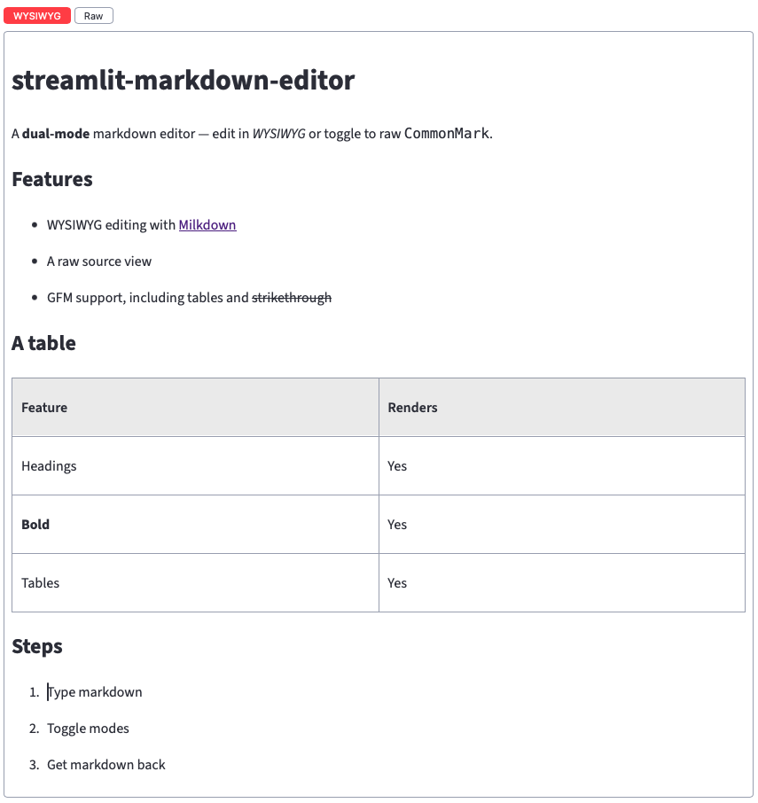

# streamlit-markdown-editor

A Streamlit component providing a **dual-mode (WYSIWYG ⇄ raw) markdown editor** — markdown in, markdown out. Edit in a rich WYSIWYG surface or toggle to the raw CommonMark source; both stay in sync over one canonical string.

## What it is



A Streamlit input widget for editing markdown in two synchronized modes:

- **WYSIWYG (rendered)** — powered by [Milkdown](https://milkdown.dev). You see formatted content, not syntax: format with the usual keyboard shortcuts (⌘/Ctrl-B, …) and markdown input rules (type `# ` for a heading, `- ` for a list; GFM tables), which convert to rendered elements as you type. There is no formatting toolbar.
- **Raw** — the CommonMark source as plain text, powered by [CodeMirror 6](https://codemirror.net) with markdown syntax highlighting.

A toggle above the editor switches modes; the two views stay in sync over a single canonical markdown string, and the caret is carried across a switch on a best-effort (line/column) basis. The widget takes markdown in and returns markdown out — nothing else to wire up.

## Installation

```bash
pip install streamlit-markdown-editor
# or
uv add streamlit-markdown-editor
```

## Quickstart

```python
import streamlit as st
from streamlit_markdown_editor import st_markdown_editor

# Markdown in, markdown out: pass the initial markdown, get the edited markdown back.
markdown = st_markdown_editor("# Hello\n\nStart typing…", key="editor")

st.markdown(markdown)
```

Run it with `streamlit run app.py`. The editor loads the markdown you pass as
`value` and returns the current markdown on every rerun — equal to `value` on the
first render (before any edit) and the edited markdown thereafter. Use the toggle
above the editor to switch between the WYSIWYG and raw views.

## API reference

```python
st_markdown_editor(
    value: str = "",
    *,
    key: str | None = None,
    equivalent: Callable[[str, str], bool] | None = None,
    width: int | Literal["stretch", "content"] = "stretch",
    height: int | Literal["stretch", "content"] = "content",
) -> str
```

| Parameter | Description |
| --- | --- |
| `value` | The markdown to load into the editor. On reruns, pass the markdown you want reflected; the editor reconciles an external change against any in-progress edit. Defaults to `""`. |
| `key` | A stable widget key. Use it to render more than one editor on a page, or to preserve editor state across reruns. **Required when `equivalent` is set.** |
| `equivalent` | `equivalent(candidate, current) -> bool` — decides whether an inbound `value` is a genuine external change or an echo of the editor's own output (your canonicalization / equality). When provided, `key` is required. Omitted → byte-equality. |
| `width` | Component width: a pixel `int`, `"stretch"` (default, fills the container), or `"content"`. |
| `height` | Component height: a pixel `int`, `"content"` (default, fits the content), or `"stretch"`. |

**Returns** `str` — the current markdown: equal to `value` on the first render (before any edit), and the edited markdown thereafter.

Passing `equivalent` without `key` raises `StreamlitAPIException`. For the full
reference, see `help(st_markdown_editor)`.

**When to use `equivalent`.** By default the editor uses byte-equality to tell its
own output apart from a value you pass in — all you need when you feed the returned
markdown straight back as `value`. If your app *transforms* the markdown between
reruns (canonicalizing or reformatting it before passing it back), byte-equality
breaks: the reformatted echo looks like a brand-new external value on every rerun,
so the editor keeps re-loading it and clobbering the user's cursor and in-progress
edits. Supply `equivalent(candidate, current)` to define when two markdown strings
count as the *same document* (your normalization) — then a reformatted echo is
recognized as an echo and left alone, while a genuinely new `value` is still
adopted. Most apps don't need it.

## Example

A runnable demo is in [`examples/app.py`](examples/app.py) — two panels covering the
plain round-trip and the inbound-reconcile (`equivalent`) behavior:

```bash
streamlit run examples/app.py
```

## Requirements

- Python ≥ 3.10
- Streamlit ≥ 1.60 (for the v2 components API)

## License

MIT — see [LICENSE](LICENSE).
